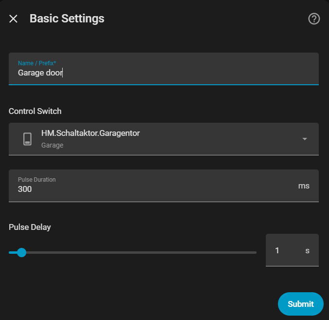
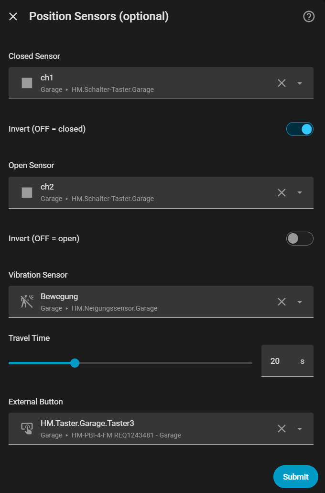
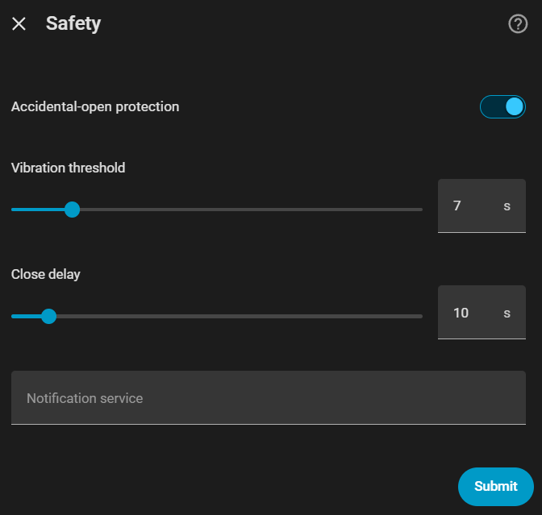
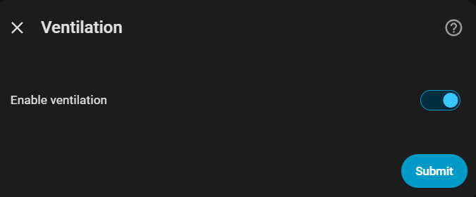
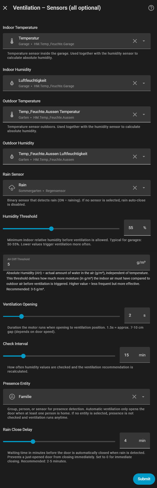

# Smart Garage

🇩🇪 [Deutsche Version](README_DE.md)

<!-- Badges -->
<p align="center">

[![HACS Custom][hacs-badge]][hacs-url]
[![GitHub Release][release-badge]][release-url]
[![License][license-badge]][license-url]
[![Hassfest][hassfest-badge]][hassfest-url]
[![HACS Validation][hacs-val-badge]][hacs-val-url]
[![CodeQL][codeql-badge]][codeql-url]
[![Downloads][downloads-badge]][release-url]

</p>

<!-- Logo -->
<p align="center">
  
</p>

<p align="center">
  <b>Home Assistant custom integration for impulse-based garage doors</b><br>
  <sub>Open · Close · Ventilate · Monitor — fully automated, fully local</sub>
</p>

<!-- HACS Install Button -->
<p align="center">
  <a href="https://my.home-assistant.io/redirect/hacs_repository/?owner=thokoh74-DE&repository=smart-garage&category=integration">
    
  </a>
  &nbsp;&nbsp;
  <a href="https://my.home-assistant.io/redirect/config_flow_start/?domain=smart_garage">
    
  </a>
</p>

---

## 🏠 What is Smart Garage?

Smart Garage manages **impulse-based garage doors** — the kind where a single relay press cycles through:

> **Open → Stop → Close → Stop → Open → …**

Unlike simple on/off switches, Smart Garage uses a **pulse-counting state machine** that knows exactly where your door is — even after a Home Assistant restart, even when operated by a physical button, even when stopped mid-travel.

Designed for **Homematic IP** hardware but works with **any impulse-driven garage door motor** that has a Home Assistant switch or button entity.

---

## ✨ Key Features

<table>
<tr>
<td width="60">🚪</td>
<td><b>Impulse-Based Cover</b><br>Pulse-counting state machine with sync points from limit switches. Knows the exact door state at all times.</td>
</tr>
<tr>
<td>📍</td>
<td><b>Live Position</b><br>Estimates position during movement based on travel time. Shows "Position 45%" when stopped mid-travel.</td>
</tr>
<tr>
<td>💾</td>
<td><b>State Persistence</b><br>Survives HA restarts. Restores sync state and pulse count via RestoreEntity.</td>
</tr>
<tr>
<td>🌬️</td>
<td><b>Ventilation Control</b> (optional)<br>Auto-opens door to a small gap based on absolute humidity. Respects presence and daylight. Manual switch included.</td>
</tr>
<tr>
<td>🌧️</td>
<td><b>Rain Auto-Close</b> (optional)<br>Closes the door when rain is detected. Configurable delay. Push notification before closing.</td>
</tr>
<tr>
<td>🛡️</td>
<td><b>Accidental Opening Protection</b><br>Detects when the door moves significantly beyond the ventilation gap — confirmed by the top limit switch or sustained vibration beyond a threshold — and auto-closes with notification. Triggers only when the ventilation position was reached automatically (humidity-based) or via the manual ventilation switch and the door then overshoots. Never triggers for an explicit open command (UI, service call, or physical button), even from a ventilating state.</td>
</tr>
<tr>
<td>📡</td>
<td><b>Actor Monitoring</b><br>Alerts when the control switch goes unavailable while the door is open. All entities mark as unavailable.</td>
</tr>
<tr>
<td>🔘</td>
<td><b>External Button Detection</b><br>Recognizes physical button presses and updates the state machine accordingly.</td>
</tr>
<tr>
<td>📊</td>
<td><b>Diagnostics</b><br>Full state dump downloadable from the device page. Mirror sensors for dashboard display.</td>
</tr>
<tr>
<td>🌍</td>
<td><b>Multilingual</b><br>Full German + English translations. Entity IDs always use English. Display names follow your HA language.</td>
</tr>
</table>

---

## 📋 Requirements

| Component | Required? | Purpose |
|:----------|:---------:|:--------|
| **Switch or Button entity** | ✅ Required | Triggers the garage door motor (e.g. HmIP-PCBS) |
| Limit switch — bottom | ⭐ Recommended | Confirms closed position (e.g. HmIP-FCI6 ch1) |
| Limit switch — top | ⭐ Recommended | Confirms open position (e.g. HmIP-FCI6 ch2) |
| Vibration / tilt sensor | 💡 Optional | Detects door movement + enables safety (e.g. HmIP-STV) |
| External button entity | 💡 Optional | Detects physical button presses |
| Temperature + humidity — indoor | 💡 Optional | Enables ventilation control |
| Temperature + humidity — outdoor | 💡 Optional | Enables ventilation control |
| Rain sensor | 💡 Optional | Enables rain auto-close |
| Presence entity | 💡 Optional | Ventilation only when someone is home |
| Notification service | 💡 Optional | Push notifications for safety events |

> 💡 **Graceful degradation**: The integration works with just a control switch. Each optional sensor adds capabilities. Without climate sensors → no ventilation. Without rain sensor → no rain auto-close. The entities for disabled features are simply not created.

---

## 📦 Installation

### Via HACS (recommended)

<a href="https://my.home-assistant.io/redirect/hacs_repository/?owner=thokoh74-DE&repository=smart-garage&category=integration">
  
</a>

**Or manually:**
1. Open HACS → **Integrations** → ⋮ → **Custom repositories**
2. URL: `https://github.com/thokoh74-DE/smart-garage`
3. Category: **Integration**
4. Search for **Smart Garage** → Install → Restart HA

### Manual Installation

1. Download the [latest release](https://github.com/thokoh74-DE/smart-garage/releases)
2. Extract and copy `custom_components/smart_garage/` to your HA `config/custom_components/`
3. Restart Home Assistant

---

## ⚙️ Configuration

<a href="https://my.home-assistant.io/redirect/config_flow_start/?domain=smart_garage">
  
</a>

**Or:** Settings → Devices & Services → Add Integration → **Smart Garage**

### 5-Step Setup Wizard

<details>
<summary><b>Step 1 — Basic Settings</b></summary>



| Field | Description |
|:------|:------------|
| **Name / Prefix** | Becomes the device name and prefix for all entity IDs (e.g. "Garagentor" → `cover.garagentor`, `sensor.garagentor_pulse_count`). Default depends on HA language. |
| **Control Switch** | The switch or button entity that triggers the garage door motor (e.g. `switch.hm_schaltaktor_garagentor`). |
| **Pulse Duration** | How long the relay stays ON for each pulse (in ms). Default: 300 ms. |
| **Pulse Delay** | Minimum wait time between any two consecutive pulses (in seconds). Increase if the actor misses pulses. Default: 1.0 s, recommended for Homematic IP: 1.5–2.0 s. |
</details>

<details>
<summary><b>Step 2 — Position Sensors (all optional)</b></summary>



| Field | Description |
|:------|:------------|
| **Closed Sensor** | Binary sensor confirming the door is fully closed (e.g. HmIP-FCI6 ch1). |
| **Invert (OFF = closed)** | Enable if the sensor reports OFF when the door is closed (common for Homematic IP). |
| **Open Sensor** | Binary sensor confirming the door is fully open (e.g. HmIP-FCI6 ch2). |
| **Invert (OFF = open)** | Enable if the sensor reports OFF when the door is open. |
| **Vibration Sensor** | Detects door movement. Used for safety (accidental opening detection). |
| **Travel Time** | How long the door takes to move from fully closed to fully open (in seconds). Used for position estimation. |
| **External Button** | Event or binary sensor for detecting physical button presses. |
</details>

<details>
<summary><b>Step 3 — Safety</b></summary>



| Field | Description |
|:------|:------------|
| **Accidental-open protection** | When enabled, detects if the door moves too far during ventilation and auto-closes. |
| **Vibration threshold** | How many seconds the vibration sensor must stay active before the safety check triggers. |
| **Close delay** | Seconds to wait before auto-closing after accidental opening is detected. Gives time for notification. |
| **Notification service** | Service to call for push notifications (e.g. `notify.pushover`). Leave empty for persistent HA notifications. |
</details>

<details>
<summary><b>Step 4 — Ventilation</b></summary>



Enable or disable the ventilation feature. When enabled, a fifth step appears for climate sensors.
</details>

<details>
<summary><b>Step 5 — Climate Sensors & Thresholds (all optional)</b></summary>



| Field | Description |
|:------|:------------|
| **Indoor Temperature** | Temperature sensor inside the garage. Used to calculate absolute humidity. |
| **Indoor Humidity** | Relative humidity sensor inside the garage (%). |
| **Outdoor Temperature** | Temperature sensor outdoors. |
| **Outdoor Humidity** | Relative humidity sensor outdoors (%). |
| **Rain Sensor** | Binary sensor (ON = raining). If not set, rain auto-close is disabled. |
| **Humidity Threshold** | Minimum indoor relative humidity (%) before ventilation is allowed. Typical for garages: 50–55%. Lower values trigger ventilation more often. |
| **AH Diff Threshold** | Absolute Humidity difference in g/m³. The indoor air must be this much more humid than outdoor for ventilation to trigger. Higher = less frequent but more effective. Recommended: 3–5 g/m³. See [How Ventilation Works](#-how-ventilation-works). |
| **Ventilation Opening** | How long the motor runs when opening to ventilation position. 1.5 s ≈ 7–10 cm gap. |
| **Check Interval** | How often humidity values are checked and the ventilation recommendation is recalculated. |
| **Presence Entity** | Group, person, or sensor. Ventilation only opens when someone is home. If not set, presence is not checked. |
| **Rain Close Delay** | Minutes to wait before closing the door when rain is detected. Prevents a just-opened door from closing immediately. 0 = close immediately. Recommended: 2–5 min. |
</details>

### Reconfiguration

After setup, click the ⚙️ gear icon on the integration to access the **menu-based options flow** with **4 independent sections**. Edit only what you need — no clicking through everything.

---

## 📊 Entities

### Controls

| Entity | Type | Created |
|:-------|:-----|:--------|
| *(device name)* | `cover` | Always |
| Ventilation Auto | `switch` | When ventilation is enabled |
| Rain Auto Close | `switch` | When rain sensor is configured |
| Manual Ventilation | `switch` | When ventilation is enabled |

### Sensors

| Entity | Type | Created |
|:-------|:-----|:--------|
| Ventilation Recommendation | `sensor` | When climate sensors are configured |
| Abs. Humidity Indoor | `sensor` | When climate sensors are configured |
| Abs. Humidity Outdoor | `sensor` | When climate sensors are configured |
| Dew Point Indoor | `sensor` | When climate sensors are configured |
| Dew Point Outdoor | `sensor` | When climate sensors are configured |
| Ventilation Active | `binary_sensor` | When ventilation is enabled |
| Actor Reachable | `binary_sensor` | Always |

### Diagnostics

| Entity | Type | Description |
|:-------|:-----|:------------|
| Current State | `sensor` | Human-readable state with position (e.g. "Position 45%") |
| Last Drive | `sensor` | Last state transition (translated enum) |
| Last Command | `sensor` | Last user command (translated enum) |
| Pulse Count | `sensor` | Number of pulses sent since the last confirmed limit-switch sync; resets to 0 when the door reaches fully closed or fully open |
| Limit Switch Bottom | `sensor` | Mirrors hardware sensor state |
| Limit Switch Top | `sensor` | Mirrors hardware sensor state |
| Vibration Sensor | `sensor` | Mirrors hardware sensor state |
| Control Switch | `sensor` | Mirrors hardware sensor state |

---

## 🔧 How It Works

### The Impulse Motor Cycle

```
From CLOSED:
  Pulse 1 → OPENING    Pulse 2 → STOPPED
  Pulse 3 → CLOSING    Pulse 4 → STOPPED
  Pulse 5 → OPENING    (cycle repeats)

From OPEN:
  Pulse 1 → CLOSING    Pulse 2 → STOPPED
  Pulse 3 → OPENING    Pulse 4 → STOPPED
  Pulse 5 → CLOSING    (cycle repeats)
```

### Pulse Counting State Machine

The integration tracks two values:
- **Sync state** — last confirmed position from a limit switch (`CLOSED` or `OPEN`)
- **Pulse count** — number of pulses since the last sync

The current door state is derived as: **`sync_state + (pulse_count - 1) mod 4`**

When a limit switch fires → pulse counter resets to 0 (new sync point).

### Position Estimation

During movement: `position = elapsed_time ÷ travel_time × 100%`

Position is estimated relative to a **baseline captured at the start of each movement**, not always from 0% or 100%. This matters for repeated stop/reverse cycles: opening, stopping, then opening again continues accurately from the last known position instead of resetting the estimate to a full 0–100% traversal.

When limit switches are configured, the integration **never** assumes the door reached its end position based on time alone — it waits for sensor confirmation.

### Multi-Pulse Commands

| From → To | Pulses needed | Sequence |
|:----------|:-------------:|:---------|
| Closed → Opening | 1 | Open |
| Opening → Stopped | 1 | Stop |
| Stopped (up) → Closing | 1 | Close |
| Stopped (up) → Opening | 3 | Close → Stop → Open |
| Stopped (down) → Closing | 3 | Open → Stop → Close |
| Closing → Opening | 2 | Stop → Open |

All multi-pulse sequences always run to completion once started — see [Command Serialization](#command-serialization) below for how overlapping commands are handled.

### Command Serialization

Issuing a new command while a previous multi-pulse sequence (e.g. a close→stop→open reversal) is still in progress used to be able to send pulses from two overlapping commands at the same time, desyncing the pulse counter from the real door position. Every command now runs under an exclusive lock:

1. A new command waits for any in-progress command to finish completely before starting.
2. Multi-pulse sequences always run to completion undisturbed — they are never interrupted mid-sequence.
3. Once the previous command has fully finished, the new command starts and acts on the door's actual resulting state.

This guarantees pulses from two commands can never interleave. The trade-off is a small delay (at most a couple of pulse-delay intervals, typically well under 2 seconds) if a new command is issued while a multi-pulse sequence is still running — a safer and far more predictable behavior than trying to interrupt pulses mid-flight.

You can watch the **Pulse Count** diagnostic sensor to see this in action: it increments with each pulse sent and resets to 0 the moment a limit switch confirms the door is fully closed or fully open, letting you verify the pulse-counting state machine matches the real door position at any time.

---

## 🔌 Supported Hardware

### Tested With

| Device | Type | Purpose |
|:-------|:-----|:--------|
| **HmIP-PCBS** | Switching actuator | Control relay (impulse) |
| **HmIP-FCI6** | Contact interface | Limit switches (ch1 = bottom, ch2 = top) |
| **HmIP-STV** | Tilt sensor | Vibration / movement detection |

### Homematic IP Wiring Notes

| Device | Channel | Function | Invert? |
|:-------|:--------|:---------|:--------|
| HmIP-FCI6 | ch1 | Limit switch bottom | **Yes** (OFF = closed) |
| HmIP-FCI6 | ch2 | Limit switch top | **No** (ON = open) |
| HmIP-PCBS | — | Control switch | — |
| HmIP-STV | — | Vibration sensor | — |

### Compatible With

Any impulse-based garage door motor that can be controlled via a Home Assistant `switch` or `button` entity. This includes motors from Hörmann, Marantec, Chamberlain, Sommer, Novoferm, and others that use a simple impulse/toggle mechanism.

---

## 🐛 Troubleshooting

<details>
<summary><b>Entity IDs show wrong language</b></summary>

Entity IDs are generated once when entities are first created. If they have German names from a previous version, delete the integration and re-add it.
</details>

<details>
<summary><b>Homematic actor loses connection</b></summary>

Increase the **Pulse delay** setting. Homematic IP devices can lose connectivity when receiving too many RF signals in quick succession. Default is 1 second; try 2-3 seconds.
</details>

<details>
<summary><b>Wrong state after HA restart</b></summary>

The state is persisted via RestoreEntity. If incorrect, operate the door once so a limit switch fires and triggers a sync (resets pulse counter to 0).
</details>

<details>
<summary><b>Stop doesn't respond quickly</b></summary>

Fixed in v1.0: service calls use fire-and-forget (no `blocking=True`), so the stop command is processed immediately without waiting for Homematic RF confirmation.
</details>

<details>
<summary><b>Position becomes inaccurate after repeated stop/reverse cycles</b></summary>

Fixed in v1.0.3: position is now calculated relative to a baseline captured at the start of each movement, instead of always assuming travel from 0% or 100%. Update to the latest version if you still see this.
</details>

<details>
<summary><b>False "accidental opening" warning when I open the door myself</b></summary>

Fixed in v1.0.3: the safety warning no longer fires for an explicit open command (UI, service call, or physical button), even from a ventilating state. It now correctly fires only when the door overshoots past the ventilation gap after an automatic or manual ventilation trigger, without an explicit open command.
</details>

<details>
<summary><b>Door doesn't respond correctly (or moves the wrong way) after rapid Open/Stop/Open clicks</b></summary>

Fixed in v1.0.4: commands are now fully serialized by simply waiting for any in-progress multi-pulse sequence to finish completely, instead of interrupting it. An earlier interrupt-based approach (v1.0.3) could itself cause a sequence to abort after only 1 of 3 pulses if two commands overlapped, leaving the door stuck. Update to the latest version if you still see this. Watch the **Pulse Count** diagnostic sensor to verify the internal counter matches physical door movement.
</details>

<details>
<summary><b>Need debug data?</b></summary>

Go to the device page → ⋮ → **Download diagnostics**. This creates a JSON file with the complete state machine state, sensor states, and configuration (sensitive data redacted).
</details>

---

## 💨 How Ventilation Works

### The Problem: Relative vs. Absolute Humidity

Relative humidity (%) depends on temperature: warm air holds more moisture than cold air. A garage at 22°C / 65% relative humidity contains **more water** (12.6 g/m³) than outdoor air at 18°C / 72% (11.3 g/m³) — even though the outdoor percentage is higher. Opening the door in this situation actually removes moisture from the garage.

**Absolute humidity** (AH, in g/m³) measures the actual amount of water per cubic meter of air, independent of temperature. This is what the integration uses to decide whether ventilation is effective.

### What Gets Calculated

Every check interval (default: 15 minutes), the integration reads four sensor values and calculates:

| Value | Formula | Example |
|:------|:--------|:--------|
| **AH Indoor** | Magnus formula from indoor temp + humidity | 22°C, 65% → **12.62 g/m³** |
| **AH Outdoor** | Magnus formula from outdoor temp + humidity | 18°C, 72% → **11.25 g/m³** |
| **AH Difference** | AH Indoor − AH Outdoor | 12.62 − 11.25 = **1.37 g/m³** |
| **Dew Point** | Temperature at which condensation forms | Indoor: **15.2°C**, Outdoor: **13.1°C** |

### Decision Logic

```
IF outdoor AH ≥ indoor AH:
    → "Do Not Ventilate" (outdoor air is more humid, ventilation makes it worse)

IF it is raining:
    → "Do Not Ventilate" (rain air is too moist)

IF AH difference ≥ threshold (default 5.0 g/m³)
   AND indoor relative humidity ≥ threshold (default 55%):
    → "Ventilate" (significant difference + indoor is actually humid)

IF AH difference ≥ half the threshold (2.5 g/m³):
    → "Neutral" (noticeable difference, but not large enough)

ELSE:
    → "Do Not Ventilate"
```

### When Does the Door Actually Open?

The recommendation alone does **not** open the door. **All** of these conditions must be true simultaneously:

| Condition | Check |
|:----------|:------|
| ✅ **Ventilation Auto** switch is ON | User has enabled automatic ventilation |
| ✅ Recommendation is **"Ventilate"** | Calculation determined ventilation is effective |
| ✅ Door is **closed** | Can't ventilate if already open |
| ✅ Someone is **home** | Presence entity shows "home" (if configured) |
| ✅ **Sun is up** | Between sunrise and sunset |
| ✅ It is **not raining** | Rain sensor is OFF (if configured) |

If any condition becomes false while the door is in ventilation position (e.g. everyone leaves, sun sets, or recommendation changes to "Do Not Ventilate"), the door is automatically **closed**.

### Recommended Settings

| Setting | Garage | Basement | Workshop |
|:--------|:-------|:---------|:---------|
| Humidity Threshold | 50–55% | 55–60% | 45–50% |
| AH Diff Threshold | 3–5 g/m³ | 3–5 g/m³ | 3–5 g/m³ |
| Ventilation Opening | 1.5–2.5 s | 1.5–2.0 s | 2.0–3.0 s |
| Check Interval | 15 min | 15 min | 10 min |

---

## 🏆 Quality Scale

This integration targets the [Home Assistant Integration Quality Scale](https://developers.home-assistant.io/docs/core/integration-quality-scale/) **Silver** tier.

| Rule | Status |
|:-----|:------:|
| Config Flow | ✅ |
| Entity Unique ID | ✅ |
| Unique Config Entry | ✅ |
| Test Before Setup | ✅ |
| Config Entry Unloading | ✅ |
| Entity Unavailable | ✅ |
| Action Exceptions | ✅ |
| Parallel Updates | ✅ |
| Integration Owner | ✅ |
| Diagnostics | ✅ |
| Entity Translations | ✅ |
| Devices | ✅ |
| Reconfigure Flow | ✅ |

See [`quality_scale.yaml`](custom_components/smart_garage/quality_scale.yaml) for detailed status.

---

## 🤝 Contributing

Contributions are welcome! Please read [CONTRIBUTING.md](CONTRIBUTING.md) before submitting a PR.

## 📄 License

[MIT](LICENSE) © Thomas

---

<!-- Badge URLs -->
[hacs-badge]: https://img.shields.io/badge/HACS-Custom-41BDF5.svg?style=for-the-badge
[hacs-url]: https://github.com/hacs/integration
[release-badge]: https://img.shields.io/github/v/release/thokoh74-DE/smart-garage?style=for-the-badge
[release-url]: https://github.com/thokoh74-DE/smart-garage/releases
[license-badge]: https://img.shields.io/github/license/thokoh74-DE/smart-garage?style=for-the-badge
[license-url]: https://github.com/thokoh74-DE/smart-garage/blob/main/LICENSE
[hassfest-badge]: https://img.shields.io/github/actions/workflow/status/thokoh74-DE/smart-garage/hassfest.yml?label=Hassfest&style=for-the-badge
[hassfest-url]: https://github.com/thokoh74-DE/smart-garage/actions/workflows/hassfest.yml
[hacs-val-badge]: https://img.shields.io/github/actions/workflow/status/thokoh74-DE/smart-garage/hacs.yml?label=HACS&style=for-the-badge
[hacs-val-url]: https://github.com/thokoh74-DE/smart-garage/actions/workflows/hacs.yml
[codeql-badge]: https://img.shields.io/github/actions/workflow/status/thokoh74-DE/smart-garage/codeql.yml?label=CodeQL&style=for-the-badge
[codeql-url]: https://github.com/thokoh74-DE/smart-garage/actions/workflows/codeql.yml
[downloads-badge]: https://img.shields.io/github/downloads/thokoh74-DE/smart-garage/total?style=for-the-badge
